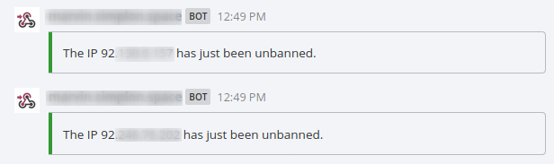

# fail2ban-mattermost-notifications

Receive Mattermost notifications when Fail2ban triggers an action (ban, unban, start, stop)




## Requirements

* curl
* geoiplookup

## Usage

* Copy mattermost.sh (/opt/scripts/mattermost.sh for example) and set your webhook url (line 3)
* Copy mattermost.conf into /etc/fail2ban/action.d and set the right script location
* Update your jails and include the mattermost action

Example with the Nginx jail

```
[nginx-http-auth]
enabled = true
port    = http,https
logpath = %(nginx_error_log)s
action = ufw
         mattermost
```

That's it !